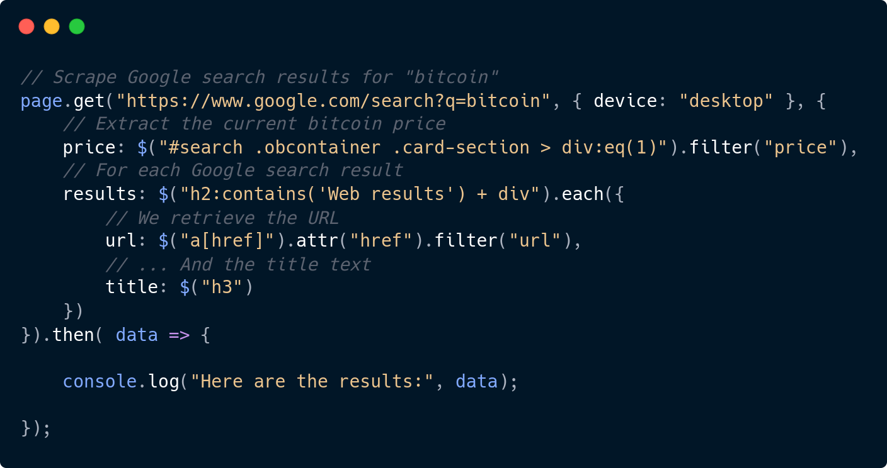
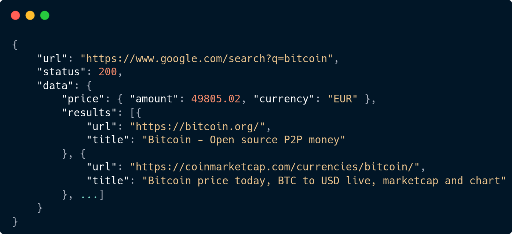

<p align="center">
    <a href="https://scrapingapi.io/?utm_source=github&utm_medium=readme&utm_campaign=logo" target="_blank">
        
    </a>
</p>

<h1 align="center"><b><u>One</u> powerful API to scrape <u>all</u> the web</b></h1>

<p align="center">
    Easily scrape data from any website, without worrying about captchas and bot detection mecanisms.
</p>


<div align="center">
 

[](https://www.npmjs.com/package/scrapingapi)
[](https://discord.gg/m7KWXcBaBu)
<span>&nbsp;&nbsp;&nbsp;&nbsp;&nbsp;&nbsp;&nbsp;&nbsp;</span>
<a target="_blank" href="https://twitter.com/intent/tweet?url=https://bit.ly/3iAvAmP&text=Easily%20#scrape%20data%20from%20any%20website,%20without%20worrying%20about%20#captchas%20and%20#bot%20detection%20mecanisms.">
    </a>
<a target="_blank" href="https://www.linkedin.com/shareArticle?mini=true&url=https://bit.ly/3qC2IyV">
    </a>
<a target="_blank" href="https://news.ycombinator.com/submitlink?u=https://bit.ly/3qBkLFe&t=Easily%20scrape%20data%20from%20any%20website%2C%20without%20taking%20care%20of%20captchas%20and%20bot%20detection%20mecanisms.">
    </a>

</div>

<p align="center">
    <a href="https://scrapingapi.io/?utm_source=github&utm_medium=readme&utm_campaign=links"><b>Website</b></a> •
    <a href="https://discord.gg/m7KWXcBaBu"><b>Discord</b></a> • 
    <a href="https://github.com/scrapingapi/scraper/stargazers"><b>⭐ Give a Star</b></a>
</p>  

<p align="center">
    <a target="_blank" href="#simple-usage-example">
        
        
    </a>
</p>

## Features

* No captcha, no bot detection. Websites will see you as a human.
* Integrated [**data extraction**](#extractors):
    * Easily extract data with CSS / jQuery-like selectors
    * Use filters to get ultra-clean data: url, price, ...
    * Iterate through items (ex: search results, products list, articles, ...)
* **Bulk requests**: Up to 3 per call
* Post json / form-encoded body
* Set request device, headers and cookies
* Returns **response body, headers, final URL & status code**
* Typescript typings

-----------

<p align="center">
    Do you like this project ? Please let me know,
    <a target="_blank href="https://github.com/scrapingapi/scraper/stargazers"><b>⭐ Give a Star :)</b></a>
</p>

------------

## Get started in 5 minutes chrono

1. **Install** the package
    ```console
    npm install --save scrapingapi
    ```
    If you're a Yarn guy:
    ```console
    yarn add --save scrapingapi
    ```

2. Create your free [API Key](https://scrapingapi.io/?utm_source=github&utm_medium=readme&utm_campaign=getstarted)

3. Make your first request (example below 👇)

## Simple Usage Example

Here is an example of scraping **current Bitcoin price + search results** from Google Search.

```javascript
import Scraper, { $ } from 'scrapingapi';
const page = new Scraper('API_KEY');

// Scrape Google search results for "bitcoin"
page.get("https://www.google.com/search?q=bitcoin", { device: "desktop" }, {
    // Extract the current bitcoin price                  
    price: $("#search .obcontainer .card-section > div:eq(1)").filter("price"),
    // For each Google search result
    results: $("h2:contains('Web results') + div").each({
        // We retrieve the URL
        url: $("a[href]").attr("href").filter("url"),
        // ... And the title text
        title: $("h3")
    })
}).then( data => {

    console.log("Here are the results:", data);

});
```

The `Scraper.get` method sends a **GET request** to the provided URL, and automatically extract the data you asked: the price and the results.


In the data parameter, you will get a [TScrapeResult](src/types.ts#L107) object, containing the scraping results.

```json
{
    "url": "https://www.google.com/search?q=bitcoin",
    "status": 200,
    "time": 2.930,
    "data": {
        "price": {
            "amount": 49805.02,
            "currency": "EUR"
        },
        "results": [{
            "url": "https://bitcoin.org/",
            "title": "Bitcoin - Open source P2P money"
        }, {
            "url": "https://coinmarketcap.com/currencies/bitcoin/",
            "title": "Bitcoin price today, BTC to USD live, marketcap and chart"
        }, {
            "url": "https://www.bitcoin.com/",
            "title": "Bitcoin.com | Buy BTC, ETH & BCH | Wallet, news, markets ..."
        }, {
            "url": "https://en.wikipedia.org/wiki/Bitcoin",
            "title": "Bitcoin - Wikipedia"
        }]
    }
}
```

### Use Typescript

Take advantage of the power of typescript by typing your response data:

```typescript
import Scraper, { $, TExtractedPrice } from '../src';
const page = new Scraper('API_KEY');

type BitcoinGoogleResults = {
    // Metadata generated by the price filter
    price: TExtractedPrice,
    // An array containing an informations object for each Google search result
    results: {
        url: string,
        title: string
    }[]
}

page.get<BitcoinGoogleResults>("https://www.google.com/search?q=bitcoin").then( ... );
```

------------------

# Documentation / Guide

Let's consider we want to scrape an Amazon product page to retrieve the following info:

* Product info
    * Title
    * Current price
    * Image URL
* Reviews
    * Average rating
    * List of reviews

Ready ? Let's start step by step:

1. [Make the **Request**](#request)
    - [**Method**: GET, POST](#request-methods)
    - [**Options**: device, cookies, body, withBody, withHeaders](#request-options)
2. [**Extract** your data](#extractors)
    - [Simple values](#value-extractor)
    - [Filters a Validators](#item-extractor)
    - [Optional values](#item-extractor)
3. [**Iterate** through lists](#response)
4. [Handle the **Response**](#response)
5. [Another **Example**](#another-example)

## 1. Make the Request

### 1.1 Request Methods

This SDK provides one method per supported HTTP method:

* GET: [See the definition](src/index.ts#66)
    ```typescript 
    page.get( url, options, extractor );
    ```
* POST: [See the definition](src/index.ts#74)
    ```typescript
    page.post( url, body, bodyType, options, extractor );
    ```
* Bulk requests: 
    With the `scrape` method, You can also send up to **3 requests per call** if each of them points to different domain names.
    [See the definition](src/index.ts#38)
    ```typescript
    page.scrape( requests );
    ```

<details><summary>Show Example</summary>
<p>

For our example, we only need to make a get request.

```typescript
page.get( "https://www.amazon.com/dp/B08L76BSZ5", <options>, <extractors> );
```

</p>
</details>

### 1.2 Request Options

```typescript 
page.get( url, options, extractor );
               ^^^^^^^
```

Depending on your needs, you can change some settings for your request:

* **device** (string): Which user-agent do you want to use for your request: `desktop`, `mobile` or `tablet`
    ```json
    { "device": "mobile" }
    ```
* **cookies** (string): The cookie string you want to pass to the request. Example:
    ```json
    { "cookies": "sessionId=34; userId=87;" }
    ```
* **withBody** (boolean): If you want to get the page HTML in the response. Default: `false`
    ```json
    { "withBody": true }
    ```
* **withHeaders** (boolean): If you want to retrieve the response headers. Default: `false`
    ```json
    { "withHeaders": true }
    ```

For POST requests only:

* **body** (object): The data to send in your POST request. Must be combined with bodyType.
    ```json
    { "body": { "name": "bob", "age": 25 } }
    ```
* **bodyType** (string): In which format do you want to POST your data: `form` or `json`
    ```json
    { "bodyType": "form" }
    ```

#### Practical Example

<details><summary>Show the Example</summary>
<p>

Here, we will simulate a mobile device, because the mobile version of Amazon is easier to scrape given that there are less elements on the page. We will also retrieve the response headers.

```typescript
page.get("https://www.amazon.com/dp/B08L76BSZ5", { device: 'mobile', withHeaders: true }, <extractors>);
```

</p>
</details>

## 2. Extract your data

We're now at the most interesting part: how to extract & filter values, and how to iterate items.

```typescript 
page.get( url, options, extractor );
                        ^^^^^^^^^
```

### 2.1 Extract a value

Let's start with the basics: extract a single information from the webpage.

Extractors are simple javascript objects, were you can associate a `key` (the name of your data) to a `value selector`.
The following example will extract the text content of the element that matches given selector:

```typescript
{
    <key>: $( <selector> )
}
```

Here you have two elements:

1. The **Key**: You can choose any name for the key, but it should not:

* Start by a `$`
* Be a reserved key: `select` is the one and only reserved key for the moment

2. The **Selector** of the element which contains the information you want to extract. 
    To create a value selector will use the `$()` function. If you've already used jQuery, it should look a bit familiar :)
    And for the attribute you put in the `$()` function, it's a CSS-like / jQuery-like selector that matches the element you want to extract the value.
    <details><summary>Show examples</summary>
    <p>

    - `$("h3")`: Simply matches all `h3` elements
        - Matches: 
            ```html
            <h3>This is a title</h3>
            ```
        - Do not matches because it's not a `h3` element:
            ```html
            <p>Hello</p>
            ```
    - `$("a.myLink[href]")`: Matches `a` elements having the class `myLink`, and where the `href` attribute is defined
        - Matches: 
            ```html
            <a class="myLink anotherclass" href="https://scrapingapi.io">Link Text</a>
            ```
        - Do not matches, because it doesn't contains the `myLink` class
            ```html
            <a class="thisClassIsAlone" href="https://scrapingapi.io">Link Text</a>
            ```
    - `$("h2:contains('Scraping API') + div")`: Matches `div` elements that are next to `h2` elements where the content is equal to `Scraping API`
        - Matches: 
            ```html
            <h2>Scraping API</h2>
            <div>is cool</div>
            ```
        - Do not matches, because the `div` element is not next to the `h2` element
            ```html
            <h2>Scraping API</h2>
            <p>is maybe not</p>
            <div>well configured</div>
            ```
    Don't hesitate to go deeper by checking theses references:
    * [CSS selectors](https://www.w3schools.com/cssref/css_selectors.asp)
    * [jQuery selectors](https://www.w3schools.com/jquery/jquery_ref_selectors.asp) 

    </p>
    </details> 

But instead of extracting the text content of the element, you can also extract the HTML content.
For that, simply use the `.html()` method:

```typescript
{
    <key>: $( <selector> ).html()
                          ^^^^^^^
}
```

It's also possible to extract any other [HTML attributes](https://www.w3schools.com/tags/ref_attributes.asp): `href`, `class`, `src`, etc ...

```typescript
{
    <key>: $( <selector> ).attr( <attribute> )
                           ^^^^^^^^^^^^^^^^^^^
}
```

#### Practical Example

<details><summary>Show the Example</summary>
<p>

Let's start by extracting the product info:

* Title
* Current price
* Image URL
* Rating

```typescript
page.get("https://www.amazon.com/dp/B08L76BSZ5", { device: 'mobile', withHeaders: true }, {

    title: $("#title"),
    price: $("#corePrice_feature_div .a-offscreen:first"),
    image: $("#main-image").attr("src"),
    reviews: {
        rating: $(".cr-widget-Acr [data-hook='average-stars-rating-text']")
    }

});
```

Pretty easy, isn't it ? 🙂
With this code, you will get the following data:

```json
{
    "title": "sportbull Unisex 3D Printed Graphics Novelty Casual Short Sleeve T-Shirts Tees",
    "price": "$9.99",
    "image": "https://m.media-amazon.com/images/I/71c3pFtZywL._AC_AC_SY350_QL65_.jpg",
    "reviews": {
        "rating": "4.4 out of 5"
    }
}
```

That's cool, but here we have two problems:

* The price is a string, and we need to parse it if we want to separate the price amount from the currency. 
    In a perfect world, we could simply make a 
    ```typescript
    const amount = parseFloat( data.price.substring(1) );
    ``` 
    to get the amount.
    Yes, but depending on any factors, he price format could vary in `9.99 USD`, `9.99 dollars incl. taxes`, `$9.99 USD free shipping`, etc ... 
    In addition, what warranties you that the price element systematically contains a price ? For some reaosns, we could have another random value.
    We want to build something strong, so we need to solve this issue.
* Same issue with the image URL, we need to filter and validate it to be sure we have an URL in the correct form.

That's a great transition to see how you can filter the data you've extracted.


</p>
</details>

## 2.2. Filter the data

To ensure that the data we've extracted matches with what we're expecting, we can specify filters for each selector:

```typescript
$( <selector> ).attr( <attribute> ).filter( <filter name> )
                                   ^^^^^^^^^^^^^^^^^^^^^^^^
```

For the moment, we only support two filters:

* **url**: Checks if the value is an URL. If the URL is relative, it will be transformed into an absolute URL.
* **price**: Powered by the [price-extract](https://github.com/scrapingapi/price-extract) package, this filter ensures that the value express a price, autodetect the currency ISO code, and separate the amount from the currency.
    It will give you an object with the price info:
    ```json
    { "amount": 9.99, "currency": "USD" }
    ```

💡 **If you want I add another filter, please don't hesitate to share your purposal by [submitting a an issue](https://github.com/scrapingapi/price-extract/issues).** Thank you !

<details><summary>Show the Example</summary>
<p>

To come back on our Amazon example, we will simply add filters on the `price` and `image` data:

```typescript
page.get("https://www.amazon.com/dp/B08L76BSZ5", { device: 'mobile', withHeaders: true }, {

    title: $("#title"),
    price: $("#corePrice_feature_div .a-offscreen:first").filter("price"),
                                                         ^^^^^^^^^^^^^^^^
    image: $("#main-image").attr("src").filter("url"),
                                       ^^^^^^^^^^^^^^
    reviews: {
        rating: $(".cr-widget-Acr [data-hook='average-stars-rating-text']")
    }
});
```

By running this code, you will get the following data:

```json
{
    "title": "sportbull Unisex 3D Printed Graphics Novelty Casual Short Sleeve T-Shirts Tees",
    "price": { "amount": 9.99, "currency": "USD" },
    "image": "https://m.media-amazon.com/images/I/71c3pFtZywL._AC_AC_SY350_QL65_.jpg",
    "reviews": {
        "rating": "4.4 out of 5"
    }
}
```

We get clean price data, and we're certain that `image` is an URL.

</p>
</details>

## 2.3. Optional values

By default, all values you will select are required. That means we absolutly want this value to be present in the item, otherwhisee, this item will be excluded from the response.

But you can of course make a value optional:

```typescript
$( <selector> ).attr( <attribute> ).optional()
                                   ^^^^^^^^^^^
```

When a value is optional and it has not been found on the scraped page, you will get an undefined value.

Here are the reasons why a value could not be found:

* The selector do not matches with any element in the page
* The attribute you want to retrieve do not exists
* The value is empty
* The filter has rejected the value

### Practical Example

<details><summary>Show the Example</summary>
<p>

Let's consider that the average rating is not necessarly present on the page.
Even if we're not able to get this info, we still want to retireve all the other values.
So, we have to make the `reviews.rating` data optional.

```typescript
page.get("https://www.amazon.com/dp/B08L76BSZ5", { device: 'mobile', withHeaders: true }, {

    title: $("#title"),
    price: $("#corePrice_feature_div .a-offscreen:first").filter("price"),
    image: $("#main-image").attr("src").filter("url"),
    reviews: {
        rating: $(".cr-widget-Acr [data-hook='average-stars-rating-text']").optional()
                                                                           ^^^^^^^^^^^
    }

});
```

If `reviews.rating` has not been found, you will get the following data:

```json
{
    "title": "sportbull Unisex 3D Printed Graphics Novelty Casual Short Sleeve T-Shirts Tees",
    "price": { "amount": 9.99, "currency": "USD" },
    "image": "https://m.media-amazon.com/images/I/71c3pFtZywL._AC_AC_SY350_QL65_.jpg",
    "reviews": {}
}
```

</p>
</details>

### And next ?

Now, you know how to extract high quality data from webpages.
But what if we want to extract lists, like search results, products lists, blog articles, etc ... ?
That's the next topic 👇

## 3. Iterate through lists

The scrapingapi SDK allows you to extract every item that matches a selector. 
Again, it's highly inspired by the jQuery API:

```typescript
$( <items selector> ).each( <values> );
```

Firstly, you have to provide the **items selector** which will match all the DOM elements you want to iterate.
Then, you specify the values you want to extract for each element that will be iterated, like we've seen previously.

💡 All the selectors you provide to extract the `values` will be executed inside the `items selector`.

### The `this` selector

In the `values`, if the selector is `"this"`, it will make reference to the items selector.

By exemple:

```type
$("> ul.tags > li").each({
    text: $("this")
})
```

The `text` value will be the text content of every `"> ul.tags > li` element.

### Practical Example

<details><summary>Show the Example</summary>
<p>

We can now extract every review item:

```typescript
page.get("https://www.amazon.com/dp/B08L76BSZ5", { device: 'mobile', withHeaders: true }, {

    title: $("#title"),
    price: $("#corePrice_feature_div .a-offscreen:first").filter("price"),
    image: $("#main-image").attr("src").filter("url"),
    reviews: {
        rating: $(".cr-widget-Acr [data-hook='average-stars-rating-text']").optional(),
        list: $("#cm-cr-dp-aw-review-list > [data-hook='mobley-review-content']").each({
            author: $(".a-profile-name"),
            title: $("[data-hook='review-title']")
        })
    }
});
```

You will get the following result:

```json
{
    "title": "sportbull Unisex 3D Printed Graphics Novelty Casual Short Sleeve T-Shirts Tees",
    "price": { "amount": 9.99, "currency": "USD" },
    "image": "https://m.media-amazon.com/images/I/71c3pFtZywL._AC_AC_SY350_QL65_.jpg",
    "reviews": {
        "rating": "4.4 out of 5",
        "list": [
            { "author": "Jon", "title": "Great shirt; very trippy" },
            { "author": "LK", "title": "Birthday Gift for Bartender Son" },
            { "author": "Yessica suazo", "title": "Decepcionada del producto que recibi" },
            { "author": "Avid Reader", "title": "Worth it." },
            { "author": "Nancy K", "title": "Husband loves it!" },
            { "author": "Mychelle", "title": "Gets Noticed" },
            { "author": "Suzy M. Lewis", "title": "Wish I had bought a size up" },
            { "author": "Devann Shultz", "title": "Great buy!" }
        ]
    }
}
```

</p>
</details>

## 5. Handle the Response

Every time you launch a request, you will receive a response following this format:

```typescript
type Response = {
    // The final URL after all the redirections
    url: string,
    // The scraped page status code
    status: number,
    // The time, in seconds, your request took to be resolved from our server
    // The communication delays between your app and our servers are ignored
    time: number,
    // The scraped page headers (must provide the withHeaders option)
    headers?: { [key: string]: string },
    // The page HTML (when the withBody option is true)
    body?: string,
    // The extracted data, if you provided extractors
    data?: object
```

### Optimize the response time

Every option uses additionnal CPU resources, slows down communication inside scrapingapi's network, and increase your response size.

That's why it's better do use as few options as possible to make your responses faster.

-------

## Another example


Consider that `http://example.com/products` responds with a webpage containing the following HTML:

```html
<h2>Space Cat Holograms to motive you programming</h2>
<p>Free shipping to all the Milky Way.</p>
<section id="products">

    <article class="product">
        
        <h3>Sandwich cat lost on a burger rocket</h3>
        <strong class="red price">123.45 $</strong>
        <ul class="tags">
            <li>sandwich</li>
            <li>burger</li>
            <li>rocket</li>
        </ul>
    </article>

    <article class="product">
        
        <h3>Aliens can't sleep because of this cute DJ</h3>
        <ul class="tags">
            <li>aliens</li>
            <li>sleep</li>
            <li>cute</li>
            <li>dj</li>
            <li>music</li>
        </ul>
    </article>

    <article class="product">
        
        <h3>Travelling at the speed of light with a radioactive spaceship</h3>
        <p class="details">
            Warning: Contains Plutonium.
        </p>
        <strong class="red price">456.78 $</strong>
        <ul class="tags">
            <li>pizza</li>
            <li>slice</li>
            <li>spaceship</li>
        </ul>
    </article>

    <article class="product">
        
        <h3>Gentleman dropped his litter into a black hole</h3>
        <p class="details">
            Since he found this calm planet.
        </p>
        <strong class="red price">undefined</strong>
        <ul class="tags">
            <li>luxury</li>
            <li>litter</li>
        </ul>
    </article>
</section>
```

Let's extract the product list: 

```typescript
type Product = {
    name: string,
    image: string,
    price: { amount: number, currency: string },
    tags: { text: string }[],
    description?: string
}

scraper.get<Product[]>("http://example.com/products", {}, $("#products > article.product").each({

    name: $("> h3"),,
    image: $("> img").attr("src").filter("url"),
    price: $("> .price").filter("price"),
    tags: $("> ul.tags > li").each({
        text: $("this")
    }),
    description: $("> .details").optional()

}));
```

Here is the response:

```json
{
    "url": "http://example.com/products",
    "status": 200,
    "data": [{
        "name": "Sandwich cat lost on a burger rocket",
        "image": "https://wallpapercave.com/wp/wp4014371.jpg",
        "price": { "amount": 123.45, "currency": "USD" },
        "tags": [
            { "text": "sandwich" },
            { "text": "burger" },
            { "text": "rocket" }
        ]
    },{
        "name": "Gentlemen can't find his litter anymore",
        "image": "https://wallpapercave.com/wp/wp4575192.jpg",
        "price": { "amount": 456.78, "currency": "USD" },
        "tags": [
            { "text": "pizza" },
            { "text": "slice" },
            { "text": "spaceship" }
        ]
    }]
}
```

Did you notice ? In the request, the `price` data has been marked as required. but for two HTML elements we've iterated with the `$foreach` instruction, **the extractor wasn't able to extract the price**.

* `Aliens can't sleep because of this cute DJ` doesn't contains any element that matches with `> .price`
* `Gentleman dropped his litter into a black hole` contains a `.price` element, but the content text doesn't represents a price

-----------

# About

## Need any additional information or help ? 

* Search if a related issue [has not been created before](https://github.com/scrapingapi/scraper/issues)
* If not, feel free to [create a new issue](https://github.com/scrapingapi/scraper/issues/new)
* For more personal questions, or for profesionnal inquiries: 
    <details>
    <summary>Send me an email</summary>

    `contact@gaetan-legac.fr`
    </details>

## Credits

For any complaint about abused kittens that has been sent to the deep space, see it with [WallpaperCave](https://wallpapercave.com/space-cat-wallpapers).